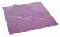
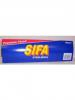
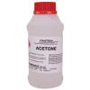

***(Now on [Hack a Day](http://hackaday.com/2011/11/25/etching-your-own-pcbs/) - I'm chuffed!  :) )***

With the explosion of the hobbyist microcontroller scene the past few years, PCB fab houses have sprung up left right and centre. At these wonderous places, you can get professional quality PCBs fabricated for your every desires for reasonable costs. They can range from very low cost and looooong lead times, to acceptable prices (~$50-$100) for low volume runs ('protoype' services). At the larger end of the scale, you can panelise your design and get even better value per PCB...

Whilst these services are great - and put pro-quality PCBs in the everymans hands - they have besides the cost and lead times one other annoying problem - how do you know your design even works ? Nothing more infuriating than getting 5 professionally silk screened coffee coasters back after waiting 3 weeks.

Given the above, and because I'm notoriously impatient and hate waste - I often fab my own boards still. Using this method I can draw up a design in Eagle and from there have an etched PCB waiting for components in just 30 minutes. Fantastic for Friday Night Hacking! Using this method you can, with a bit of practice, get down to 8mil quite easily and some have even managed smaller.

This technique is some amalgamations of various how-tos and guides I've read on the internet over the years - so many aspects are probably famliar to some of you. But having chatted with people down at the space at various times - I thought it might be worth while detailing the quick method I happen to use - it will probably take longer to read through my ramblings than it will to etch your own board !! ;) .

So Grab a Coffee, sit back, relax and read my "Quick and Easy PCB Etching Guide".

Quick Overview
--------------

So whats going on you may ask - how do you get an Eagle File etched onto a PCB in 30 minutes. Well - most of it comes down to 3 key learnings over the years - Samsung branded Toner, HP Everyday Photo Paper and the "Direct Etch" Method. By combining these 'best ofs' from various guides of different techniques you end up with a pretty trouble and mess free solution.

Laser Printers use toner which is highly plasticised. Different brands make different types of toners - some are more hardy than others, some are a lot more prone to undercutting etc. Through both personal experience and having distilled quite a few forums - Samsung it seems makes the best compromise of toner for etching. Its quite hardy, but doesn't end up needing a sand blaster to remove from the board :)

Those that have read toner transfer guides before may be familiar with the importance of the paper used. Many guides recommend the use of "Catalogue Paper" or "Brochures" that are that glossy thin stuff that sticks together when wet in your letterbox. This paper can work - but it often doesn't and is horrible to try and remove once the toner is transfered. I stumbled across the HP Everyday Photo Paper recommendations via the Yahoo Homebrew PCB Group a few years back and quite simply have never looked back. Its the perfect size for most of the boards I fab, so there is little wastage, and with a brief 5 minute soak it is ready to remove from the board. Final cleanup can be achieved with a rubberised non-scratch scourer.

Direct Etch is a method that is actually described in detail as part of the [PCB Fab-in-a-Box kits](http://www.pulsarprofx.com/pcbfx/main_site/pages/start_here/overview.html) from PulsarPro-FX - but you certainly don't need the kit to leverage the etching method! This method offers many advantages over traditional methods as it uses the smallest amount of Ferric Chloride neccesary. It also provides a much faster and superior etch with fewer chances of undercutting - all with just a household sponge!

The Supplies (and some good to have options)
--------------------------------------------

<table>
    <tbody>
        <tr>
            <td colspan="2">
            <h3><strong>Items</strong></h3>
            </td>
            <td>
            <h3><strong>Description</strong></h3>
            </td>
            <td>
            <h3><strong>Where you Can Buy it 
            </strong></h3>
            </td>
        </tr>
        <tr>
            <td></td>
            <td>
            
<strong>Quality Laser Printer</strong>

            </td>
            <td>
            
Needed to print the artwork onto the paper. I recommend the Samsung range due to their Toners - it is an ideal compromise in terms of etch resistance and removal.

            
<strong>Update: In a complete brain fart when I wrote this article I put &quot;Brother&quot; - as you'll see from the Pic to the left I meant Samsung! Will teach me to work on multiple things at once... grumble.... SAMSUNG People!! :)</strong>

            </td>
            <td>
            
<em>Officeworks/DSE/HardlyNormals etc 
            </em>

            </td>
        </tr>
        <tr>
            <td></td>
            <td><strong>Laminator</strong></td>
            <td>
            
After much decision making - I choose a GBC H65 Laminator. Whilst a tad more expensive at $99 than some other possibilities - it is perfectly suited to making PCBs as it features dual heat modes for thick and thin laminates, in-roller heaters and a wide opening meaning it needs no modifications at all and thus retains its use as a normal laminator as well :) . Creative A4 Laminators can also be used, but will require a thermostat and a slight mod to the opening.

            
<strong>UPDATE:</strong><em><strong> I'm working through with another MHV member  to see if the $20 Lowell Laminators can be made to work. The great guys at Ultrakeet have a <a href="http://ultrakeet.com.au/index.php?id=article&amp;name=superFuserV2">how-to mod guide</a> - but am still in process of modding the laminator to offer feedback on results</strong></em>.

            </td>
            <td><a href="http://www.officeworks.com.au/retail/products/Office-Supplies/Conference-and-Presentation/Laminating/Laminating-Machines/Pouch-Laminating/PEBLH65"><strong>Officeworks</strong></a></td>
        </tr>
        <tr>
            <td></td>
            <td><strong>HP Everyday Photopaper</strong></td>
            <td>HP Everyday Photopaper is one of the little secrets of making it so easy. Its a 170gsm paper that takes the toner beautifully, transfers to the copper very well and best of all releases with extreme ease and little fuss. It beats the 'catalogue paper' solutions hands down and is one of the reasons I happily do this method regularly. You can't substitute this part really - other photo papers these days tend to be WATERPROOF and don't work with this process half as well as the HP Everyday does. YMMV if you deviate from this recommendation ;)</td>
            <td><a href="http://www.officeworks.com.au/retail/products/Office-Supplies/Paper/Specialty-and-Presentation-Papers/Photo-Paper/INHPD5441A"><strong>Officeworks </strong></a><strong>/ </strong>DSE</td>
        </tr>
        <tr>
            <td></td>
            <td><strong>Blank PCB Stock</strong></td>
            <td>PCB Blanks. I used Jaycar 2oz boards for the PCB I made during this article, but I recommend planning ahead and getting 1oz boards from the internet. They etch much much faster for even less time from PC to PCB. </td>
            <td><a href="http://jaycar.com.au/productView.asp?ID=HP9512&amp;keywords=HP+PCB&amp;form=KEYWORD"><strong>Jaycar </strong></a><strong>/ </strong>Elsewhere</td>
        </tr>
        <tr>
            <td></td>
            <td><strong>Ferric Chloride Etchant</strong></td>
            <td>
            
Good old FeCl Etchant. I can't go past it for the speed at which it can etch boards using the method in this article. Its also the most reliable for use with Toner Transfer to ensure a good etch with no undercutting etc. Whilst harder to get in liquid form from stores these days - you can still get it through electronics supply houses in a powder form you add water to, such as digi-key or mouser. Ultrakeet are also a good online supplier through which you can get some.

            
<strong>UPDATE</strong> <em><strong>I've been informed that the <a href="http://www.nontoxicprint.com/etchcopperandbrass.htm">Edinburgh Etch </a>Solution works extremly well with this method. I have been meaning to try myself but haven't yet so can't offer personal experience. I will update once I've tried.</strong></em>

            </td>
            <td><strong> </strong><a href="http://ultrakeet.com.au/index.php?id=1&amp;cID=5804&amp;subID=500&amp;bollocks=none"><strong>Ultrakeet</strong></a></td>
        </tr>
        <tr>
            <td></td>
            <td><strong>Low-Adhesive Tape</strong></td>
            <td>A good low-adhesive tape is neccesary to affix the PCB to the paper for heating. I have recently come to appreciate the 3M/Scotch Blue Painters tape as it is low-adhesive, non marking and slightly heat proof meaning it wont shrink and pull the artwork as it goes through the laminator.</td>
            <td> Hardware Stores</td>
        </tr>
        <tr>
            <td></td>
            <td><strong>Disposable Latex Gloves</strong></td>
            <td>Used to holding and etching the board. Handy regardless really around the house.</td>
            <td><a href="http://www2.woolworthsonline.com.au/Shop/ProductDetails?Stockcode=202866&amp;name=chux-latex-gloves-disposable-clean-skin&amp;search=gloves"><strong>Supermarkets </strong></a>and elsewhere</td>
        </tr>
        <tr>
            <td></td>
            <td><strong>Non-Scratch Scourers*</strong></td>
            <td>Removes paper burrs from the PCB prior to etching, also good to use to scrub the PCB when preparing for etching and used to remove the Toner post etching. See - Handy! :)</td>
            <td><a href="http://www2.woolworthsonline.com.au/Shop/ProductDetails?Stockcode=226528&amp;name=vileda-sponge-non-scratch-scouring&amp;search=vileda"><strong>Supermarkets</strong></a> and elsewhere</td>
        </tr>
        <tr>
            <td></td>
            <td><strong>Fine Steel Wool (0000)*</strong></td>
            <td>For when the PCB is really grubby before hand and used for getting stubborn toner off if you dont have any acetone handy</td>
            <td> Hardware stores</td>
        </tr>
        <tr>
            <td></td>
            <td><strong>Generic Household Sponges</strong></td>
            <td>Used during the etching process - just cheap and cheerful normal ones that I usually end up cutting into a further 4 sponges each</td>
            <td><a href="http://www2.woolworthsonline.com.au/Shop/ProductDetails?Stockcode=25724&amp;name=homebrand-sponge-household&amp;search=sponge"><strong>Supermarkets</strong></a> and elsewhere</td>
        </tr>
        <tr>
            <td></td>
            <td><strong>Acetone* / Isopropyl Alcohol</strong></td>
            <td>For cleaning the board and later removing of the toner. Isopropyl Alcohol works but tends to leave a white powdery residue whereas the acetone is a bit nastier to work with but like everything thats a bit nastier a hell of a lot quicker and easier ;)</td>
            <td>Hardware stores and <a href="http://jaycar.com.au/productView.asp?ID=NA1064&amp;keywords=Isopropyl&amp;form=KEYWORD"><strong>Jaycar</strong></a></td>
        </tr>
        <tr>
            <td></td>
            <td><strong>PCB Lacquer*</strong></td>
            <td>Protects your PCB once etched and is solder-safe. Prevents oxidization or corrosion and eating of small tracks.</td>
            <td><a href="http://jaycar.com.au/productResults.asp?keywords=lacquer&amp;keyform=KEYWORD&amp;SUBMIT.x=0&amp;SUBMIT.y=0"><strong>Jaycar</strong></a></td>
        </tr>
        <tr>
            <td></td>
            <td><strong>Bi-Carb Soda</strong></td>
            <td>Neutralises the FeCl either for disposal or in the instance of an accidental spill</td>
            <td><a href="http://www2.woolworthsonline.com.au/Shop/ProductDetails?Stockcode=75201&amp;name=mckenzies-baking-aids-bi-carb-soda&amp;search=bi%20carb"><strong>Supermarkets </strong></a>and elsewhere</td>
        </tr>
    </tbody>
</table>

**\* Indicates Optional Item.**

Preparing your Artwork
----------------------------------------

Prep your artwork in whichever your preferred program is. Heres my board in Eagle almost ready for printing. Make sure when you print it out that if you are using a board with a Top Layer (like on the left) you need to choose to Mirror the image otherwise it will be reversed when you transfer it. If your board was routed using the bottom layer, or blue in this case, then you do not need to mirror it (Thanks to [ltkenbo](http://ltkenbo.blogspot.com/) for reminding me of this fact via Hack a Day) Also turn off everything that shouldn't be part of the etching. In the image to the left I need to turn off the Yellow borders (t\_docu) and the bottom layers link (the blue line).

Preparing the PCB
-----------------

Before you start - you need to make sure your PCB is ready to accept the toner and move onto etching. No matter how clean it looks it needs a good scrub :) To the right is two small PCBs that I have cleaned. The lower one has been treated to a good isopropyl alcohol treatment with a light steel wool scrub. If its not too cruddy - I prefer to use one of the non-scratch scourers.

Ordinarily I'd use Acetone, as Isopropyl Alcohol can leave a white residue but I didn't happen to have any Acetone handy. Make sure once you've cleaned the PCB you keep handling to a minimum, preferably even wearing the gloves already. Fingerprint oil residue can lead to uneven etching and on smaller tracks even bridging.

A brief word about the PCBs - This board was made using what I had at hand which was some Jaycar board stock. The boards are full 2oz Copper - which is great for high current and more industrial applications - but unnecssary in 90% of circumstances and it just takes longer to etch. Plan ahead and grab 1oz copper board off of the net somewhere.

Printer Settings and Printing to the HP Everyday Photo Paper
------------------------------------------------------------

Load your laser printer with the HP Everyday Photo Paper. Make sure you set the print preferences correctly to not scale the image and to utilise the correct page size for the HP paper. Set your toner settings to also be Normal or Dark (some experimentation for your particular printer may be neccesary - Avoid the temptation of cranking it to 11 though as too much toner can lead to bridging when doing fine tracks!) and ensure Toner Saving is disabled. Finally, depending on your printer, you may need to adjust the darkness settings. I like to configure a preset for the printer called "PCB" to avoid having to set everything each time.

Securing the Artwork to the PCB
---------------------------------------------------------------------------------------------------

This step should be fairly straight forward with one tip - Tape the sides of the PCB and not the top or bottom.  For whatever reason this to stop the artwork lifting from the pcb between iterations through the laminator, particularly when doing larger artworks. I have also come to adore the 3M/ScotchTape Blue Painters Tape. Its a low-adhesive tape that is very easy to remove and leaves no residue - despite the heat of the laminator.

Transfering the Artwork with the Laminator
------------------------------------------

I use a GBC H65 Laminator. The reason being it features the two modes allowing it to do thicker 125mil laminating pouches and thus reach a higher tempreature - ideal for PCB Toner Transfer. It also doesn't need modification to fit the PCBs and also features in-roller heating so it is evenly applied top and bottom at the same time as the pressure is applied. A perfect fit almost one would say ;) I originally paid \$95 from Officeworks back in 2008, but I believe they are still around the same price. If using another one, look for features mentioned above. I believe the Creative A4 can be made to work well with a minor Thermostat mod (and the acceptance of melty plastic bits eventually)

Allow the laminator to reach tempreature and then pass the board through 4-5 times. It is another one of those 'trial and error' things to find the perfect fit for your printer - too few a passes and you can leave holes in tracks and too many can end up smudging tracks together due to the heat and pressure. Start with 4 passes and see how it goes. Another thing to remember is to pass the board through at different points on the rollers - far left of the laminator and then the middle and then the far right and repeat for example - this ensures that you dont cool down the rollers too much between passes which provides an improved transfer. Finally as seen in the image on the right, try and keep the board level as it comes out - this will help prevent any lifting of the artwork between passes. You can also tell when its done roughly when its just too hot too touch - about 65o or so.

***Update: If you've tried this method and found your artwork transferred with lots of holes - then you should check to make sure that you are printing with enough toner and that the laminator is hot enough and applies enough pressure. If you read the sagas at Ultrakeet's how-to, you'll find that there is a lot to be said for which laminator you use. The \$20 Lowells look promising though!***

***Update 2: Remember - this is 170gsm paper. If your laminator is not hot enough - then this method will probably make you think it performs worse than standard copy paper! Get that laminator hot and it'll work muuuuuuuuch better (I'd say 'trust me', but then you wouldn't :) )***

Removing the Paper
------------------

Once the laminating step is complete, dunk your PCB and artwork into cold water as quickly as possibly. This helps 'snap cool' the toner and PCB ensuring it affixes itself well. After around 5 mins it should look like the image to the left. Rub the 'dry' spots of paper a bit and then lift off the paper starting at one end in a clean motion - most of it should come off pretty easy. The remainder I rub off under luke warm water (helps soften the paper quicker but not too hot ! don't want to start remelting the toner!) and use one of the valedia non-scratch scourers to clean it up. 

The board to the right has been rubbed with my thumb under running water and I then used a non-scratch pad to give it a final touch up. Try to remove as much paper as possible - its not critical - but in places where there are tight tracks or inside any lettering etc you want to make sure its cleaned up. Furry bits on a ground plane aren't an issue - so don't get too eager and rub off the toner forcing you to start again. At this point you can touch up any broken tracks or whoopsies using a Sharpie - it happens to the best of us sometimes ;).

Direct Etching
--------------

Now the fun bit - watching your artwork become a PCB before your very eyes. This method has afforded me not only the quickest PCB boards, but also the most reliable. It ensures very little chance of undercutting tracks, and you know exactly when the board is done.

Simply cut a sponge into a small square. Put on some latex disposable gloves - we'll be throwing them into a bag later along with the sponge. Grab your Ferric Chloride and put just a small 20cent coin sized dollop on the sponge. Now grab the board, and with it resting in your palm, start wiping across it in even, vertical strokes and then horizontal strokes - concentrating more on the edges than the center of the board (this is important, as the center will naturally etch faster than the corners/edges). Keep turning the sponge every couple of wipes.

This method as you'll see etches very quickly because by using the sponge and wiping you are constantly not only removing copper saturated etchant, but also wiping in 'fresh' etchant. Depending on the amount of copper you are using, you may need to freshen the etchant on the sponge one or two times during this process. For this board I found I needed to freshen it up just a smidgen towards the very end - so used all up about 5ml of Ferric Chloride solution.

Once the board is etched, you can place it in a baking soda/water solution to neutralise the remaining etchant on the board and then simply wash it under running water. I then usually grab the sponge, 'palm it' in one glove, and pull it off with the other turning it inside out and stash it into a plastic sealable bag to later neautralise and dispose of accordingly.

To remove the toner that remains a quick wipe with Acetone will get it off in seconds. If you don't have any handy - a non-scratch scourer and isopropyl alcohol works nearly as well with just a tad more elbow grease.

No mess, No Fuss, and all done in 8 minutes in this case (bloody 2oz boards grumble... ;) )

Final Steps
------------------------------------------------------------------------------

Now that your board is etched, its time to drill any holes for PTH components or headers and the like. I'm a big fan of SMD now days - but headers still usually are best served by PTH bits demanding that I drill a few holes in this board. After that I gave it a quick tin using some solder and solder wick - flooding some spots of the copper with solder and then smearing it around to 'tin' the board. As a final step, I also applied some PCB lacquer to protect the board. This particular lacquer is designed for PCBs and doesn't intefer with soldering to pads later on.

With that you should be done and can now attach the components to your freshly minted board. This particular one, stopping to take pictures aside, took about 25 minutes from PC to Soldering Components once I'd completed laying out the board in Eagle.

Maybe not as pretty as an EZPCB Board - but damn - 25minutes! :)

Happy PCB Manufacturing everyone - and please comment or ask me any questions below. All images are available in higher res via [my Flickr! stream](http://www.flickr.com/photos/ozadr1an/sets/72157628003599589/) as well.

